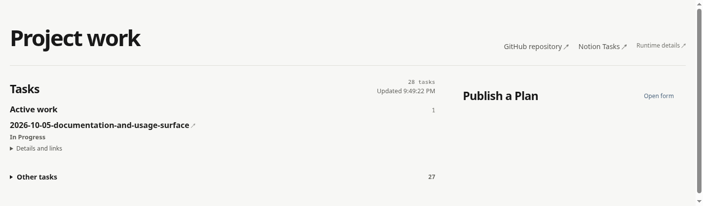

# Leesh Loop

Leesh Loop runs an agent task loop for a single GitHub repository. It connects a target repository to Notion and runs accepted Plans against that repository, while keeping the Loop files beside the target instead of adding them to it.

## Get started

Leesh Loop runs on Linux or Unix. On Windows, use WSL2. Before you start, install Node.js 20.19+ or 22.12+ with npm, Git, GitHub CLI, mise, Codex CLI, and configure the `chatgpt-shot` review command on the machine that will run the Loop. You also need access to the target GitHub repository and a Notion task database.

### 1. Make the Leesh Loop command available

Clone this repository and link its command:

```sh
git clone https://github.com/leesh7807/leesh-loop.git
cd leesh-loop
npm link
```

Sign in to GitHub CLI on this machine with access to the target repository:

```sh
gh auth login
```

### 2. Connect a target repository

The target must be a Git repository. Check out the branch you want the Loop to use, and make sure that branch has a configured remote branch. If it does not, push it with an upstream first:

```sh
git push --set-upstream origin "$(git branch --show-current)"
```

Replace `origin` with the name of the target remote if it is different.

Run `leesh-loop init` from the target repository root:

```sh
cd /path/to/your-repository
leesh-loop init
```

Init creates a sibling directory named `<repository-name>-loop`. It reads the target URL and base branch from the current branch's configured upstream and leaves the target repository unchanged. The new Loop contains its own runtime files and agent workflow.

To update that Loop from the currently installed Leesh Loop distribution, run one of these commands from its root:

```sh
leesh-loop update
leesh-loop update --workflow
```

The first command replaces the managed runtime and npm package lock while preserving the Loop's settings, environment files, workflow, workspace, and state. The second replaces only the generated root `WORKFLOW.md`, including local edits. Neither command changes the target Git repository. Updates apply the files owned by Leesh Loop as a complete snapshot; run them while the Loop is stopped.

### 3. Add the Notion connection

Move into the generated Loop and create its local environment file:

```sh
cd ../your-repository-loop
cp .env.example .env
```

Set these values in `.env`:

```dotenv
LEESH_LOOP_NOTION_DATABASE_URL=https://www.notion.so/...
NOTION_TOKEN=...
```

Keep `.env` private; it contains credentials and is excluded from Git. The Notion integration must have access to an empty database or one already set up for Leesh Loop.

On the same machine, configure the review command and make sure the Codex CLI is signed in. The first start checks the GitHub, Notion, workspace, and review setup before it accepts work.

### 4. Start the Loop

From the generated Loop directory:

```sh
npm start
```

The first start prepares the included dependencies and opens the Operator page in your browser. If it does not open automatically, visit <http://127.0.0.1:4310>. The page links to the target repository and Notion tasks, lists active and other tasks, and provides the Plan publishing form.



_The task list is live, so its tasks and counts will change. Open **Publish a Plan** to enter a Plan and choose its State._

### 5. Manage Loop instances from anywhere

The global command lists registered Loops and can start or stop one by its ID or unique name, from any working directory:

```sh
leesh-loop list
leesh-loop start <instance-id>
leesh-loop stop <instance-id>
```

The list shows each Loop's ID, name, directory, and current status. Use the ID when names repeat. `init` registers a new Loop; `update` and `update --workflow` enroll existing Loops. Successful local `npm start` calls also register Loops whose runtime includes the start registration hook.

Project settings live in the Loop root `project.toml`. Init creates a separate file for each target with the repository identity and paths already set. Edit it when you need a different worker model, workspace file, local port, or other documented setting; comments in the file explain defaults and path handling. Runtime responsibilities are described in [System responsibilities and configuration](docs/SYSTEM.md).

### 6. Publish a Plan and follow its task

In Operator, use **Publish a Plan**:

1. Paste the complete Plan in **Review the Plan**.
2. Optionally choose existing tasks under **Blocked By** when this work must wait for them.
3. Choose a publication State. **Ready** starts eligible work; **Backlog** keeps it waiting.
4. Select **Publish Plan**.

The result shows the new task identifier and State, with a link to open the task in Notion. The task appears in the Operator task list. Its State tells you where it is in the work cycle; expand **Details and links** to open the Accepted Plan and inspect task context.

Use [Plan instructions](docs/PLAN.md) when writing Plans. A task can only run after it is published in an active State and its Blocked By tasks, if any, are complete.

## About the workflow

The generated Loop's root `WORKFLOW.md` is an agent execution contract. Init builds it from [`docs/WORKFLOW_TEMPLATE.md`](docs/WORKFLOW_TEMPLATE.md) and the Loop's runtime settings; root `project.toml` points the runtime to that file. The worker reads it when it handles a task.

You do not need to read and memorize the whole contract to use Leesh Loop. If you want to understand or change a repository rule, ask the agent to explain the relevant part of `WORKFLOW.md`, its effect on task execution, and the smallest safe change. The contract determines how agents act, so changes should preserve its intent rather than turn it into a general tutorial.

The root `WORKFLOW.md` in this source repository applies to work on Leesh Loop itself. It is separate from the template used by `init` for target repositories.

## If setup fails

- If `init` says the current branch has no configured remote branch, check out the branch you intend to use, configure its Git upstream, then run `leesh-loop init` again.
- If the generated Loop folder already exists, init leaves it untouched. Use that Loop if it is the one you want, or choose a target directory with a different name.
- If `npm start` reports a missing Notion value, set it in the generated Loop's `.env` or in the environment that starts the Loop, then retry.
- If setup reports a GitHub access problem, sign in with `gh auth login` and confirm the target repository is accessible.
- If the task list cannot refresh, check that the Notion integration still has access to the database. Plan publishing and task reading report their own errors in Operator.
- The smaller **Runtime details** link in the Operator header opens the live runtime dashboard for investigating a stuck or failed task. Everyday Plan publishing and task tracking happen on the Operator page.

## Documentation

- [System responsibilities and configuration](docs/SYSTEM.md) — for operators and maintainers who need Project, readiness, Publisher, or Notion contracts.
- [Design principles](docs/DESIGN.md) — persistent UI and UX principles.
- [Plan instructions](docs/PLAN.md) — how to create and maintain work Plans.
- [Agent execution contract](WORKFLOW.md) — the contract for workers modifying Leesh Loop itself.
- [Workflow template](docs/WORKFLOW_TEMPLATE.md) — the agent contract template materialized by init.
- [E2E guide](e2e/README.md) — repository verification tooling for maintainers.

Plans and UI review evidence are repository work artifacts, not additional product setup guides.
